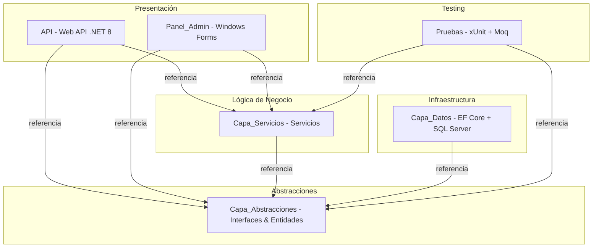
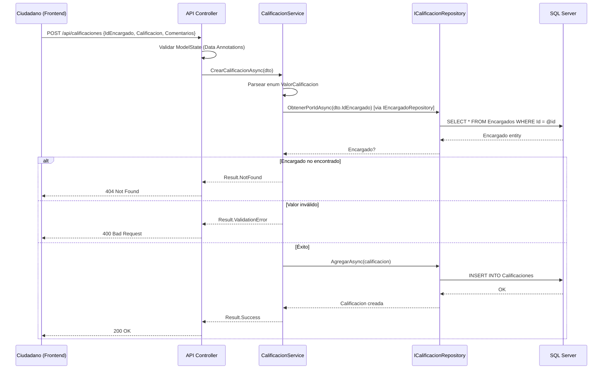
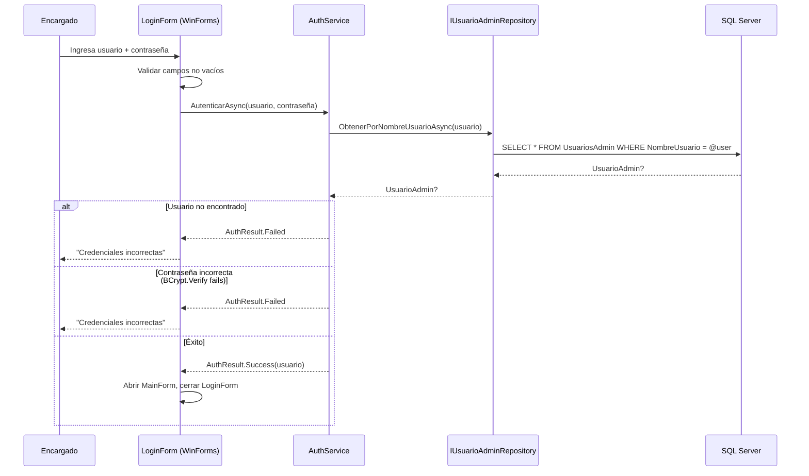
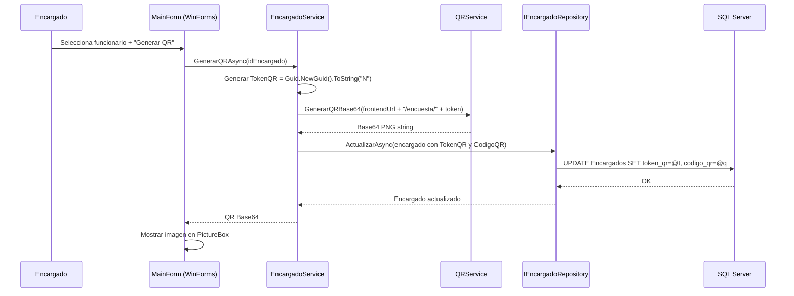
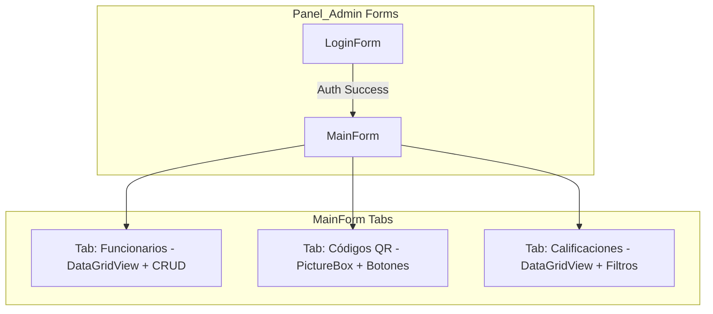
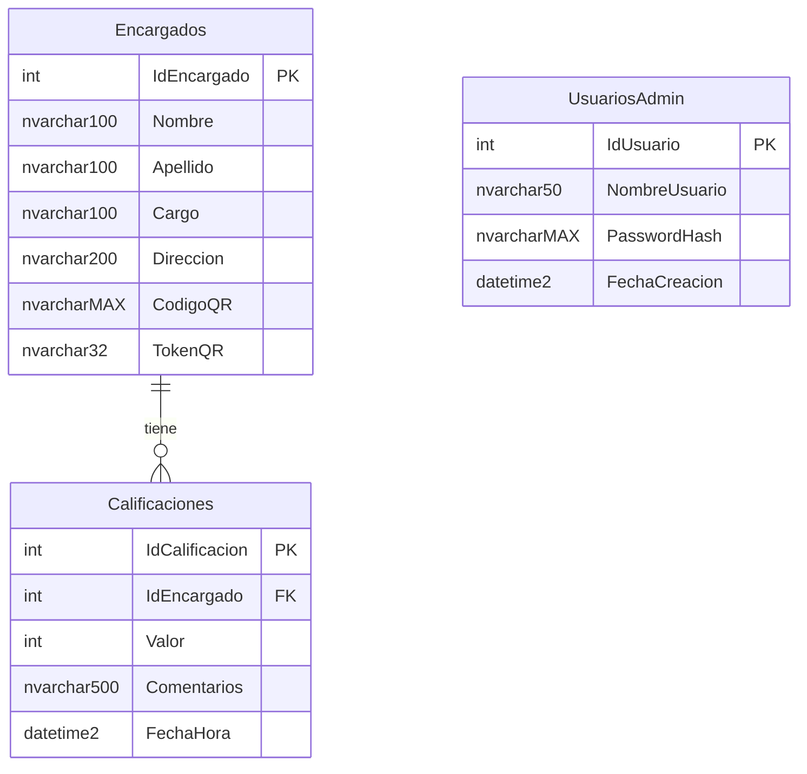

# Design Document: Project Analysis Improvements

## Overview

Este documento describe el diseño técnico para la reestructuración del proyecto **ApiEncuestaPrototipe** desde una API monolítica hacia una solución multi-proyecto con separación de responsabilidades por capas. El sistema gestiona calificaciones de encuestas para funcionarios municipales mediante códigos QR, y se extiende con un Panel Administrativo de escritorio (Windows Forms) para la gestión de funcionarios y autenticación de encargados.

La arquitectura se basa en el patrón repositorio con abstracciones, permitiendo que la capa de servicios y las capas de presentación (API y Panel_Admin) permanezcan independientes del proveedor de base de datos. Se migra de PostgreSQL a SQL Server, se implementa validación robusta, manejo global de excepciones, configuración segura y un conjunto completo de pruebas unitarias.

## Architecture

### Solution Structure



### Dependency Graph Rules

| Proyecto | Puede Referenciar | NO Puede Referenciar |
|----------|-------------------|---------------------|
| Capa_Abstracciones | (ninguno) | Todo lo demás |
| Capa_Datos | Capa_Abstracciones | Capa_Servicios, API, Panel_Admin |
| Capa_Servicios | Capa_Abstracciones | Capa_Datos, API, Panel_Admin |
| API | Capa_Servicios, Capa_Abstracciones | Capa_Datos (solo en DI root) |
| Panel_Admin | Capa_Servicios, Capa_Abstracciones | Capa_Datos (solo en DI root) |
| Pruebas | Capa_Servicios, Capa_Abstracciones | Capa_Datos |

> **Nota**: API y Panel_Admin referencian Capa_Datos únicamente en el composition root para registrar las implementaciones concretas en el contenedor de DI.

### Data Flow - Calificación de Ciudadano



### Data Flow - Login Panel Admin



### Data Flow - Generación de QR



## Components and Interfaces

### Project: Capa_Abstracciones

**Target Framework**: net8.0  
**Dependencies**: Ninguna (zero external packages)  
**Responsabilidad**: Define contratos (interfaces) y entidades del dominio compartidas.

### Project: Capa_Datos

**Target Framework**: net8.0  
**Dependencies**: Capa_Abstracciones, Microsoft.EntityFrameworkCore.SqlServer, Microsoft.EntityFrameworkCore.Design  
**Responsabilidad**: Implementaciones de repositorios con EF Core, DbContext, migraciones.

### Project: Capa_Servicios

**Target Framework**: net8.0  
**Dependencies**: Capa_Abstracciones, BCrypt.Net-Next, QRCoder  
**Responsabilidad**: Lógica de negocio, servicios, coordinación entre repositorios.

### Project: API

**Target Framework**: net8.0  
**Dependencies**: Capa_Servicios, Capa_Abstracciones, Capa_Datos (composition root), Swashbuckle.AspNetCore  
**Responsabilidad**: Controllers HTTP, middleware, configuración DI, CORS.

### Project: Panel_Admin

**Target Framework**: net8.0-windows  
**Dependencies**: Capa_Servicios, Capa_Abstracciones, Capa_Datos (composition root)  
**Responsabilidad**: Interfaz de escritorio Windows Forms para gestión administrativa.

### Project: Pruebas

**Target Framework**: net8.0  
**Dependencies**: Capa_Servicios, Capa_Abstracciones, xunit, Moq, coverlet.collector  
**Responsabilidad**: Pruebas unitarias con mocks de repositorios.

## Data Models

### Enum: ValorCalificacion

```csharp
namespace Capa_Abstracciones.Enums;

public enum ValorCalificacion
{
    Excelente = 1,
    Buena = 2,
    Regular = 3,
    Mala = 4
}
```

### Entity: Encargado

```csharp
namespace Capa_Abstracciones.Entities;

using System.ComponentModel.DataAnnotations;

public class Encargado
{
    [Key]
    public int IdEncargado { get; set; }

    [Required]
    [StringLength(100, MinimumLength = 1)]
    public string Nombre { get; set; } = string.Empty;

    [Required]
    [StringLength(100, MinimumLength = 1)]
    public string Apellido { get; set; } = string.Empty;

    [MaxLength(100)]
    public string? Cargo { get; set; }

    [MaxLength(200)]
    public string? Direccion { get; set; }

    public string? CodigoQR { get; set; }
    public string? TokenQR { get; set; }

    public ICollection<Calificacion> Calificaciones { get; set; } = new List<Calificacion>();
}
```

### Entity: Calificacion

```csharp
namespace Capa_Abstracciones.Entities;

using System.ComponentModel.DataAnnotations;
using Capa_Abstracciones.Enums;

public class Calificacion
{
    [Key]
    public int IdCalificacion { get; set; }

    [Required]
    public int IdEncargado { get; set; }

    [Required]
    public ValorCalificacion Valor { get; set; }

    [MaxLength(500)]
    public string? Comentarios { get; set; }

    public DateTime FechaHora { get; set; } = DateTime.UtcNow;

    // Navigation
    public Encargado Encargado { get; set; } = null!;
}
```

### Entity: UsuarioAdmin

```csharp
namespace Capa_Abstracciones.Entities;

using System.ComponentModel.DataAnnotations;

public class UsuarioAdmin
{
    [Key]
    public int IdUsuario { get; set; }

    [Required]
    [StringLength(50, MinimumLength = 1)]
    public string NombreUsuario { get; set; } = string.Empty;

    [Required]
    public string PasswordHash { get; set; } = string.Empty;

    public DateTime FechaCreacion { get; set; } = DateTime.UtcNow;
}
```

### DTO: CrearCalificacionDto

```csharp
namespace Capa_Abstracciones.DTOs;

using System.ComponentModel.DataAnnotations;

public class CrearCalificacionDto
{
    [Required]
    [Range(1, int.MaxValue, ErrorMessage = "IdEncargado debe ser mayor a 0")]
    public int IdEncargado { get; set; }

    [Required]
    [MaxLength(20)]
    public string Calificacion { get; set; } = string.Empty;

    [MaxLength(500)]
    public string? Comentarios { get; set; }
}
```

### DTO: CrearEncargadoDto

```csharp
namespace Capa_Abstracciones.DTOs;

using System.ComponentModel.DataAnnotations;

public class CrearEncargadoDto
{
    [Required]
    [StringLength(100, MinimumLength = 1)]
    public string Nombre { get; set; } = string.Empty;

    [Required]
    [StringLength(100, MinimumLength = 1)]
    public string Apellido { get; set; } = string.Empty;

    [MaxLength(100)]
    public string? Cargo { get; set; }

    [MaxLength(200)]
    public string? Direccion { get; set; }
}
```

### Result Pattern

```csharp
namespace Capa_Abstracciones.Common;

public class ServiceResult<T>
{
    public bool IsSuccess { get; private set; }
    public T? Value { get; private set; }
    public string? ErrorMessage { get; private set; }
    public ServiceErrorType ErrorType { get; private set; }

    public static ServiceResult<T> Success(T value) =>
        new() { IsSuccess = true, Value = value };

    public static ServiceResult<T> NotFound(string message) =>
        new() { IsSuccess = false, ErrorMessage = message, ErrorType = ServiceErrorType.NotFound };

    public static ServiceResult<T> ValidationError(string message) =>
        new() { IsSuccess = false, ErrorMessage = message, ErrorType = ServiceErrorType.Validation };

    public static ServiceResult<T> Error(string message) =>
        new() { IsSuccess = false, ErrorMessage = message, ErrorType = ServiceErrorType.Internal };
}

public enum ServiceErrorType
{
    None,
    NotFound,
    Validation,
    Internal
}
```

### AuthResult

```csharp
namespace Capa_Abstracciones.Common;

public class AuthResult
{
    public bool IsAuthenticated { get; private set; }
    public string? NombreUsuario { get; private set; }
    public string? ErrorMessage { get; private set; }

    public static AuthResult Success(string nombreUsuario) =>
        new() { IsAuthenticated = true, NombreUsuario = nombreUsuario };

    public static AuthResult Failed(string message) =>
        new() { IsAuthenticated = false, ErrorMessage = message };
}
```

## Key Functions with Formal Specifications

### Repository Interfaces (Capa_Abstracciones)

```csharp
namespace Capa_Abstracciones.Interfaces;

using Capa_Abstracciones.Entities;

public interface IEncargadoRepository
{
    Task<Encargado?> ObtenerPorIdAsync(int id);
    Task<Encargado?> ObtenerPorTokenQRAsync(string tokenQR);
    Task<IEnumerable<Encargado>> ObtenerTodosAsync();
    Task<Encargado> AgregarAsync(Encargado encargado);
    Task ActualizarAsync(Encargado encargado);
}
```

**Preconditions:**
- `id` > 0 para ObtenerPorIdAsync
- `tokenQR` no nulo ni vacío para ObtenerPorTokenQRAsync
- `encargado` no nulo y con Nombre/Apellido válidos para AgregarAsync

**Postconditions:**
- ObtenerPorIdAsync retorna null si no existe, entidad completa si existe
- AgregarAsync persiste la entidad y retorna con IdEncargado asignado
- ActualizarAsync persiste los cambios en la entidad existente

```csharp
namespace Capa_Abstracciones.Interfaces;

using Capa_Abstracciones.Entities;

public interface ICalificacionRepository
{
    Task<Calificacion> AgregarAsync(Calificacion calificacion);
    Task<IEnumerable<Calificacion>> ObtenerPorEncargadoIdAsync(int idEncargado);
    Task<IEnumerable<Calificacion>> ObtenerPorEncargadoYRangoFechasAsync(
        int idEncargado, DateTime fechaInicio, DateTime fechaFin);
}
```

**Preconditions:**
- `calificacion` no nulo con IdEncargado válido y Valor definido
- `idEncargado` > 0 para consultas
- `fechaInicio` <= `fechaFin` para filtro por rango

**Postconditions:**
- AgregarAsync persiste y retorna con IdCalificacion asignado
- Consultas retornan colección vacía si no hay resultados (nunca null)

```csharp
namespace Capa_Abstracciones.Interfaces;

using Capa_Abstracciones.Entities;

public interface IUsuarioAdminRepository
{
    Task<UsuarioAdmin?> ObtenerPorNombreUsuarioAsync(string nombreUsuario);
}
```

**Preconditions:**
- `nombreUsuario` no nulo ni vacío

**Postconditions:**
- Retorna null si el usuario no existe
- Retorna entidad completa con PasswordHash si existe

### Service Interfaces (Capa_Abstracciones)

```csharp
namespace Capa_Abstracciones.Interfaces;

using Capa_Abstracciones.Common;
using Capa_Abstracciones.DTOs;
using Capa_Abstracciones.Entities;

public interface IEncargadoService
{
    Task<ServiceResult<Encargado>> CrearEncargadoAsync(CrearEncargadoDto dto);
    Task<ServiceResult<Encargado>> ObtenerPorIdAsync(int id);
    Task<ServiceResult<Encargado>> ObtenerPorTokenQRAsync(string tokenQR);
    Task<ServiceResult<IEnumerable<Encargado>>> ObtenerTodosAsync();
    Task<ServiceResult<Encargado>> ActualizarEncargadoAsync(int id, CrearEncargadoDto dto);
    Task<ServiceResult<string>> RegenerarQRAsync(int id);
}
```

**Preconditions:**
- CrearEncargadoAsync: dto no nulo, Nombre y Apellido no vacíos
- ObtenerPorIdAsync: id > 0
- ObtenerPorTokenQRAsync: tokenQR no vacío
- RegenerarQRAsync: id > 0, encargado debe existir

**Postconditions:**
- CrearEncargadoAsync: retorna Success con TokenQR y CodigoQR generados
- ObtenerPorIdAsync: retorna NotFound si no existe
- RegenerarQRAsync: invalida token anterior, genera nuevo GUID y nueva imagen QR

```csharp
namespace Capa_Abstracciones.Interfaces;

using Capa_Abstracciones.Common;
using Capa_Abstracciones.DTOs;
using Capa_Abstracciones.Entities;

public interface ICalificacionService
{
    Task<ServiceResult<Calificacion>> CrearCalificacionAsync(CrearCalificacionDto dto);
    Task<ServiceResult<IEnumerable<Calificacion>>> ObtenerPorEncargadoAsync(int idEncargado);
    Task<ServiceResult<IEnumerable<Calificacion>>> ObtenerPorEncargadoYRangoAsync(
        int idEncargado, DateTime fechaInicio, DateTime fechaFin);
}
```

**Preconditions:**
- CrearCalificacionAsync: dto.IdEncargado > 0, dto.Calificacion parseable a ValorCalificacion
- ObtenerPorEncargadoAsync: idEncargado > 0
- ObtenerPorEncargadoYRangoAsync: fechaInicio <= fechaFin

**Postconditions:**
- CrearCalificacionAsync con valor inválido: retorna ValidationError con lista de valores válidos
- CrearCalificacionAsync con encargado inexistente: retorna NotFound
- Consultas retornan colección vacía si no hay resultados (nunca null)

```csharp
namespace Capa_Abstracciones.Interfaces;

public interface IQRService
{
    string GenerarQRBase64(string contenido);
}
```

**Preconditions:**
- `contenido` no nulo ni vacío

**Postconditions:**
- Retorna string Base64 válido que al decodificar produce bytes PNG (firma 0x89504E47)
- Imagen generada tiene al menos 300x300 píxeles

```csharp
namespace Capa_Abstracciones.Interfaces;

using Capa_Abstracciones.Common;

public interface IAuthService
{
    Task<AuthResult> AutenticarAsync(string nombreUsuario, string contraseña);
}
```

**Preconditions:**
- `nombreUsuario` no nulo ni vacío
- `contraseña` no nulo ni vacío

**Postconditions:**
- Retorna AuthResult.Success si credenciales válidas (BCrypt.Verify)
- Retorna AuthResult.Failed si usuario no existe o contraseña incorrecta
- Nunca revela cuál campo es erróneo en el mensaje de error

## Algorithmic Pseudocode

### Algorithm: Crear Encargado con QR

```csharp
// EncargadoService.CrearEncargadoAsync
public async Task<ServiceResult<Encargado>> CrearEncargadoAsync(CrearEncargadoDto dto)
{
    // PRE: dto != null, dto.Nombre.Length >= 1, dto.Apellido.Length >= 1

    var encargado = new Encargado
    {
        Nombre = dto.Nombre.Trim(),
        Apellido = dto.Apellido.Trim(),
        Cargo = dto.Cargo?.Trim(),
        Direccion = dto.Direccion?.Trim()
    };

    // Generar token QR único (GUID sin guiones, 32 hex chars)
    encargado.TokenQR = Guid.NewGuid().ToString("N");

    // Construir URL de encuesta y generar imagen QR
    var urlEncuesta = $"{_frontendUrl}/encuesta/{encargado.TokenQR}";
    encargado.CodigoQR = _qrService.GenerarQRBase64(urlEncuesta);

    // Persistir
    var resultado = await _encargadoRepository.AgregarAsync(encargado);

    // POST: resultado.IdEncargado > 0, resultado.TokenQR.Length == 32
    return ServiceResult<Encargado>.Success(resultado);
}
```

**Loop Invariants:** N/A (no loops)

### Algorithm: Crear Calificación con Validación de Enum

```csharp
// CalificacionService.CrearCalificacionAsync
public async Task<ServiceResult<Calificacion>> CrearCalificacionAsync(CrearCalificacionDto dto)
{
    // PRE: dto != null, dto.IdEncargado > 0

    // Parsear valor de calificación (case-insensitive)
    if (string.IsNullOrWhiteSpace(dto.Calificacion))
    {
        return ServiceResult<Calificacion>.ValidationError(
            "El campo Calificacion es obligatorio.");
    }

    if (!Enum.TryParse<ValorCalificacion>(dto.Calificacion, ignoreCase: true, out var valor))
    {
        var valoresValidos = string.Join(", ", Enum.GetNames<ValorCalificacion>());
        return ServiceResult<Calificacion>.ValidationError(
            $"Valor '{dto.Calificacion}' no es válido. Valores aceptados: {valoresValidos}");
    }

    // Verificar existencia del encargado
    var encargado = await _encargadoRepository.ObtenerPorIdAsync(dto.IdEncargado);
    if (encargado is null)
    {
        return ServiceResult<Calificacion>.NotFound(
            $"Encargado con Id {dto.IdEncargado} no encontrado.");
    }

    var calificacion = new Calificacion
    {
        IdEncargado = dto.IdEncargado,
        Valor = valor,
        Comentarios = dto.Comentarios?.Trim(),
        FechaHora = DateTime.UtcNow
    };

    var resultado = await _calificacionRepository.AgregarAsync(calificacion);

    // POST: resultado.IdCalificacion > 0
    return ServiceResult<Calificacion>.Success(resultado);
}
```

**Loop Invariants:** N/A

### Algorithm: Autenticación con BCrypt

```csharp
// AuthService.AutenticarAsync
public async Task<AuthResult> AutenticarAsync(string nombreUsuario, string contraseña)
{
    // PRE: nombreUsuario no vacío, contraseña no vacío

    var usuario = await _usuarioAdminRepository.ObtenerPorNombreUsuarioAsync(nombreUsuario);

    if (usuario is null)
    {
        // Mensaje genérico para no revelar qué campo es incorrecto
        return AuthResult.Failed("Credenciales incorrectas.");
    }

    // Verificar contraseña con BCrypt (cost factor >= 12)
    bool passwordValid = BCrypt.Net.BCrypt.Verify(contraseña, usuario.PasswordHash);

    if (!passwordValid)
    {
        return AuthResult.Failed("Credenciales incorrectas.");
    }

    // POST: usuario autenticado exitosamente
    return AuthResult.Success(usuario.NombreUsuario);
}
```

**Preconditions:**
- nombreUsuario y contraseña no son nulos ni vacíos
- PasswordHash en BD fue generado con BCrypt.HashPassword(password, workFactor: 12)

**Postconditions:**
- Éxito solo si usuario existe Y BCrypt.Verify retorna true
- Mensaje de error idéntico en ambos casos de fallo (seguridad)

### Algorithm: Regenerar QR

```csharp
// EncargadoService.RegenerarQRAsync
public async Task<ServiceResult<string>> RegenerarQRAsync(int id)
{
    // PRE: id > 0

    var encargado = await _encargadoRepository.ObtenerPorIdAsync(id);
    if (encargado is null)
    {
        return ServiceResult<string>.NotFound($"Encargado con Id {id} no encontrado.");
    }

    // Invalidar token anterior y generar nuevo
    encargado.TokenQR = Guid.NewGuid().ToString("N");
    var urlEncuesta = $"{_frontendUrl}/encuesta/{encargado.TokenQR}";
    encargado.CodigoQR = _qrService.GenerarQRBase64(urlEncuesta);

    await _encargadoRepository.ActualizarAsync(encargado);

    // POST: encargado.TokenQR != token_anterior, CodigoQR actualizado
    return ServiceResult<string>.Success(encargado.CodigoQR);
}
```

### Algorithm: QR Generation (QRCoder)

```csharp
// QRService.GenerarQRBase64
public string GenerarQRBase64(string contenido)
{
    // PRE: contenido no nulo ni vacío

    using var qrGenerator = new QRCodeGenerator();
    QRCodeData qrData = qrGenerator.CreateQrCode(contenido, QRCodeGenerator.ECCLevel.Q);
    using var qrCode = new PngByteQRCode(qrData);
    // pixelsPerModule = 20 → genera imagen >= 300x300px
    byte[] qrBytes = qrCode.GetGraphic(20);

    // POST: resultado es Base64 válido, bytes decodificados inician con 0x89504E47 (PNG signature)
    return Convert.ToBase64String(qrBytes);
}
```

## Service Implementations (Capa_Servicios)

### EncargadoService

```csharp
namespace Capa_Servicios;

using Capa_Abstracciones.Common;
using Capa_Abstracciones.DTOs;
using Capa_Abstracciones.Entities;
using Capa_Abstracciones.Interfaces;

public class EncargadoService : IEncargadoService
{
    private readonly IEncargadoRepository _encargadoRepository;
    private readonly IQRService _qrService;
    private readonly string _frontendUrl;

    public EncargadoService(
        IEncargadoRepository encargadoRepository,
        IQRService qrService,
        IConfiguration configuration)
    {
        _encargadoRepository = encargadoRepository;
        _qrService = qrService;
        _frontendUrl = configuration["AppSettings:FrontendUrl"]
            ?? "http://localhost:5173";
    }

    // Implementaciones: CrearEncargadoAsync, ObtenerPorIdAsync,
    // ObtenerPorTokenQRAsync, ObtenerTodosAsync, ActualizarEncargadoAsync, RegenerarQRAsync
}
```

### CalificacionService

```csharp
namespace Capa_Servicios;

using Capa_Abstracciones.Common;
using Capa_Abstracciones.DTOs;
using Capa_Abstracciones.Entities;
using Capa_Abstracciones.Enums;
using Capa_Abstracciones.Interfaces;

public class CalificacionService : ICalificacionService
{
    private readonly ICalificacionRepository _calificacionRepository;
    private readonly IEncargadoRepository _encargadoRepository;

    public CalificacionService(
        ICalificacionRepository calificacionRepository,
        IEncargadoRepository encargadoRepository)
    {
        _calificacionRepository = calificacionRepository;
        _encargadoRepository = encargadoRepository;
    }

    // Implementaciones: CrearCalificacionAsync, ObtenerPorEncargadoAsync,
    // ObtenerPorEncargadoYRangoAsync
}
```

### AuthService

```csharp
namespace Capa_Servicios;

using Capa_Abstracciones.Common;
using Capa_Abstracciones.Interfaces;

public class AuthService : IAuthService
{
    private readonly IUsuarioAdminRepository _usuarioAdminRepository;

    public AuthService(IUsuarioAdminRepository usuarioAdminRepository)
    {
        _usuarioAdminRepository = usuarioAdminRepository;
    }

    // Implementación: AutenticarAsync (ver pseudocódigo arriba)
}
```

### QRServiceImpl

```csharp
namespace Capa_Servicios;

using Capa_Abstracciones.Interfaces;
using QRCoder;

public class QRServiceImpl : IQRService
{
    public string GenerarQRBase64(string contenido)
    {
        using var qrGenerator = new QRCodeGenerator();
        QRCodeData qrData = qrGenerator.CreateQrCode(
            contenido, QRCodeGenerator.ECCLevel.Q);
        using var qrCode = new PngByteQRCode(qrData);
        byte[] qrBytes = qrCode.GetGraphic(20);
        return Convert.ToBase64String(qrBytes);
    }
}
```

## Repository Implementations (Capa_Datos)

### AppDbContext

```csharp
namespace Capa_Datos;

using Capa_Abstracciones.Entities;
using Microsoft.EntityFrameworkCore;

public class AppDbContext : DbContext
{
    public AppDbContext(DbContextOptions<AppDbContext> options) : base(options) { }

    public DbSet<Encargado> Encargados { get; set; }
    public DbSet<Calificacion> Calificaciones { get; set; }
    public DbSet<UsuarioAdmin> UsuariosAdmin { get; set; }

    protected override void OnModelCreating(ModelBuilder modelBuilder)
    {
        modelBuilder.Entity<Encargado>(entity =>
        {
            entity.ToTable("Encargados");
            entity.HasKey(e => e.IdEncargado);
            entity.Property(e => e.Nombre).HasMaxLength(100).IsRequired();
            entity.Property(e => e.Apellido).HasMaxLength(100).IsRequired();
            entity.Property(e => e.Cargo).HasMaxLength(100);
            entity.Property(e => e.Direccion).HasMaxLength(200);
            entity.Property(e => e.TokenQR).HasMaxLength(32);
            entity.HasIndex(e => e.TokenQR).IsUnique();
        });

        modelBuilder.Entity<Calificacion>(entity =>
        {
            entity.ToTable("Calificaciones");
            entity.HasKey(e => e.IdCalificacion);
            entity.Property(e => e.Valor).IsRequired();
            entity.Property(e => e.Comentarios).HasMaxLength(500);
            entity.HasOne(c => c.Encargado)
                  .WithMany(e => e.Calificaciones)
                  .HasForeignKey(c => c.IdEncargado)
                  .OnDelete(DeleteBehavior.Cascade);
        });

        modelBuilder.Entity<UsuarioAdmin>(entity =>
        {
            entity.ToTable("UsuariosAdmin");
            entity.HasKey(e => e.IdUsuario);
            entity.Property(e => e.NombreUsuario).HasMaxLength(50).IsRequired();
            entity.HasIndex(e => e.NombreUsuario).IsUnique();
        });
    }
}
```

### EncargadoRepository

```csharp
namespace Capa_Datos.Repositories;

using Capa_Abstracciones.Entities;
using Capa_Abstracciones.Interfaces;
using Microsoft.EntityFrameworkCore;

public class EncargadoRepository : IEncargadoRepository
{
    private readonly AppDbContext _context;

    public EncargadoRepository(AppDbContext context)
    {
        _context = context;
    }

    public async Task<Encargado?> ObtenerPorIdAsync(int id)
        => await _context.Encargados.FindAsync(id);

    public async Task<Encargado?> ObtenerPorTokenQRAsync(string tokenQR)
        => await _context.Encargados
            .FirstOrDefaultAsync(e => e.TokenQR == tokenQR);

    public async Task<IEnumerable<Encargado>> ObtenerTodosAsync()
        => await _context.Encargados.ToListAsync();

    public async Task<Encargado> AgregarAsync(Encargado encargado)
    {
        _context.Encargados.Add(encargado);
        await _context.SaveChangesAsync();
        return encargado;
    }

    public async Task ActualizarAsync(Encargado encargado)
    {
        _context.Encargados.Update(encargado);
        await _context.SaveChangesAsync();
    }
}
```

## Error Handling

### Global Exception Handling Middleware

```csharp
namespace API.Middleware;

using System.Net;
using System.Text.Json;

public class GlobalExceptionMiddleware
{
    private readonly RequestDelegate _next;
    private readonly ILogger<GlobalExceptionMiddleware> _logger;
    private readonly IHostEnvironment _env;

    public GlobalExceptionMiddleware(
        RequestDelegate next,
        ILogger<GlobalExceptionMiddleware> logger,
        IHostEnvironment env)
    {
        _next = next;
        _logger = logger;
        _env = env;
    }

    public async Task InvokeAsync(HttpContext context)
    {
        try
        {
            await _next(context);
        }
        catch (Exception ex)
        {
            var correlationId = Guid.NewGuid().ToString();
            _logger.LogError(ex,
                "Unhandled exception. CorrelationId: {CorrelationId}, Type: {Type}, Message: {Message}",
                correlationId, ex.GetType().Name, ex.Message);

            context.Response.ContentType = "application/json";

            var (statusCode, message) = ex switch
            {
                ArgumentException argEx => (HttpStatusCode.BadRequest, argEx.Message),
                ValidationException valEx => (HttpStatusCode.BadRequest, valEx.Message),
                _ => (HttpStatusCode.InternalServerError, "Ha ocurrido un error interno.")
            };

            context.Response.StatusCode = (int)statusCode;

            var response = new
            {
                message,
                correlationId,
                timestamp = DateTime.UtcNow.ToString("o"),
                detail = _env.IsDevelopment() ? ex.StackTrace : null
            };

            await context.Response.WriteAsync(
                JsonSerializer.Serialize(response, new JsonSerializerOptions
                {
                    PropertyNamingPolicy = JsonNamingPolicy.CamelCase,
                    DefaultIgnoreCondition = System.Text.Json.Serialization
                        .JsonIgnoreCondition.WhenWritingNull
                }));
        }
    }
}
```

### Error Response Schema

| Campo | Tipo | Siempre Presente | Descripción |
|-------|------|:-----------------:|-------------|
| message | string | ✓ | Descripción del error |
| correlationId | string (GUID) | ✓ | Identificador único de la solicitud |
| timestamp | string (ISO 8601) | ✓ | Fecha/hora UTC |
| detail | string? | Solo en Development | Stack trace completo |

### Error Scenario Mapping

| Tipo de Excepción | HTTP Status | Comportamiento |
|-------------------|:-----------:|----------------|
| ArgumentException | 400 | Mensaje de la excepción |
| ValidationException | 400 | Mensaje de la excepción |
| Cualquier otra | 500 | Mensaje genérico |

## CORS Configuration

```csharp
// Program.cs - API Configuration
var corsOrigins = builder.Configuration
    .GetSection("Cors:AllowedOrigins")
    .Get<string[]>() ?? Array.Empty<string>();

builder.Services.AddCors(options =>
{
    options.AddDefaultPolicy(policy =>
    {
        if (corsOrigins.Length > 0)
        {
            policy.WithOrigins(corsOrigins)
                  .AllowAnyMethod()
                  .AllowAnyHeader();
        }
        // Si no hay orígenes configurados, no se añade Access-Control-Allow-Origin
    });
});
```

### appsettings.Development.json

```json
{
  "Cors": {
    "AllowedOrigins": [
      "http://localhost:5173",
      "http://localhost:3000"
    ]
  },
  "ConnectionStrings": {
    "DefaultConnection": ""
  }
}
```

### appsettings.Production.json

```json
{
  "Cors": {
    "AllowedOrigins": [
      "https://mi-dominio-produccion.com"
    ]
  }
}
```

## Secure Configuration Management

### Configuration Precedence (highest to lowest)

1. **Environment Variables** (production deployment)
2. **User Secrets** (development, `dotnet user-secrets`)
3. **appsettings.{Environment}.json**
4. **appsettings.json** (solo estructura, sin credenciales)

### Startup Validation

```csharp
// Program.cs - Connection String Validation
var connectionString = builder.Configuration.GetConnectionString("DefaultConnection");

if (string.IsNullOrWhiteSpace(connectionString)
    || !connectionString.Contains("Server", StringComparison.OrdinalIgnoreCase)
    || !connectionString.Contains("Database", StringComparison.OrdinalIgnoreCase))
{
    Console.Error.WriteLine(
        "FATAL: La clave 'ConnectionStrings:DefaultConnection' está ausente, " +
        "vacía o no contiene los segmentos Server y Database.");
    Environment.Exit(1);
}

builder.Services.AddDbContext<AppDbContext>(options =>
    options.UseSqlServer(connectionString));
```

### appsettings.json (versionado, sin credenciales)

```json
{
  "ConnectionStrings": {
    "DefaultConnection": ""
  },
  "AppSettings": {
    "FrontendUrl": "http://localhost:5173"
  },
  "Cors": {
    "AllowedOrigins": []
  },
  "Logging": {
    "LogLevel": {
      "Default": "Information",
      "Microsoft.AspNetCore": "Warning"
    }
  },
  "AllowedHosts": "*"
}
```

## Windows Forms Architecture (Panel_Admin)

### Form Structure



### LoginForm

```csharp
namespace Panel_Admin;

public partial class LoginForm : Form
{
    private readonly IAuthService _authService;
    private int _intentosFallidos = 0;
    private DateTime? _bloqueadoHasta = null;

    public LoginForm(IAuthService authService)
    {
        _authService = authService;
        InitializeComponent();
    }

    private async void BtnLogin_Click(object sender, EventArgs e)
    {
        // Verificar bloqueo por intentos fallidos
        if (_bloqueadoHasta.HasValue && DateTime.UtcNow < _bloqueadoHasta.Value)
        {
            var restante = (_bloqueadoHasta.Value - DateTime.UtcNow).Seconds;
            lblError.Text = $"Cuenta bloqueada. Espere {restante} segundos.";
            return;
        }

        // Validar campos vacíos
        if (string.IsNullOrWhiteSpace(txtUsuario.Text))
        {
            lblErrorUsuario.Text = "El nombre de usuario es obligatorio.";
            return;
        }
        if (string.IsNullOrWhiteSpace(txtPassword.Text))
        {
            lblErrorPassword.Text = "La contraseña es obligatoria.";
            return;
        }

        try
        {
            var resultado = await _authService.AutenticarAsync(
                txtUsuario.Text.Trim(), txtPassword.Text);

            if (resultado.IsAuthenticated)
            {
                _intentosFallidos = 0;
                var mainForm = new MainForm(/* services via DI */);
                mainForm.Show();
                this.Hide();
            }
            else
            {
                _intentosFallidos++;
                if (_intentosFallidos >= 5)
                {
                    _bloqueadoHasta = DateTime.UtcNow.AddSeconds(60);
                }
                lblError.Text = "Credenciales incorrectas.";
            }
        }
        catch (Exception)
        {
            lblError.Text = "No se puede conectar al servidor.";
        }
    }
}
```

### MainForm - Gestión de Funcionarios (Tab)

```csharp
// MainForm - Tab Funcionarios key operations
private async void BtnNuevoFuncionario_Click(object sender, EventArgs e)
{
    if (!ValidarFormularioFuncionario()) return;

    var dto = new CrearEncargadoDto
    {
        Nombre = txtNombre.Text.Trim(),
        Apellido = txtApellido.Text.Trim(),
        Cargo = txtCargo.Text.Trim(),
        Direccion = txtDireccion.Text.Trim()
    };

    var resultado = await _encargadoService.CrearEncargadoAsync(dto);
    if (resultado.IsSuccess)
    {
        await CargarFuncionariosAsync(); // Refresh DataGridView
        LimpiarFormulario();
    }
    else
    {
        MessageBox.Show(resultado.ErrorMessage, "Error",
            MessageBoxButtons.OK, MessageBoxIcon.Error);
    }
}

private void TxtBusqueda_TextChanged(object sender, EventArgs e)
{
    var filtro = txtBusqueda.Text.Trim().ToLower();
    if (filtro.Length >= 1)
    {
        dgvFuncionarios.DataSource = _funcionarios
            .Where(f => f.Nombre.ToLower().Contains(filtro)
                     || f.Apellido.ToLower().Contains(filtro))
            .ToList();
    }
    else
    {
        dgvFuncionarios.DataSource = _funcionarios;
    }
}
```

### MainForm - QR Generation (Tab)

```csharp
// MainForm - Tab QR key operations
private async void BtnGenerarQR_Click(object sender, EventArgs e)
{
    if (dgvFuncionarios.SelectedRows.Count == 0)
    {
        MessageBox.Show("Debe seleccionar un funcionario.",
            "Validación", MessageBoxButtons.OK, MessageBoxIcon.Warning);
        return;
    }

    var id = (int)dgvFuncionarios.SelectedRows[0].Cells["IdEncargado"].Value;
    var resultado = await _encargadoService.RegenerarQRAsync(id);

    if (resultado.IsSuccess)
    {
        var bytes = Convert.FromBase64String(resultado.Value!);
        using var ms = new MemoryStream(bytes);
        picQR.Image = Image.FromStream(ms);
    }
}

private void BtnGuardarQR_Click(object sender, EventArgs e)
{
    if (picQR.Image is null) return;

    using var dialog = new SaveFileDialog
    {
        Filter = "PNG Image|*.png",
        FileName = $"{_selectedApellido}_{_selectedNombre}_QR.png"
    };

    if (dialog.ShowDialog() == DialogResult.OK)
    {
        picQR.Image.Save(dialog.FileName, System.Drawing.Imaging.ImageFormat.Png);
    }
}
```

## DI Registration (Composition Root)

### API Program.cs

```csharp
// Program.cs - Service Registration
var builder = WebApplication.CreateBuilder(args);

// Configuration validation
var connectionString = builder.Configuration.GetConnectionString("DefaultConnection");
// ... validation logic (see Startup Validation section above)

// EF Core + SQL Server
builder.Services.AddDbContext<AppDbContext>(options =>
    options.UseSqlServer(connectionString));

// Repositories
builder.Services.AddScoped<IEncargadoRepository, EncargadoRepository>();
builder.Services.AddScoped<ICalificacionRepository, CalificacionRepository>();
builder.Services.AddScoped<IUsuarioAdminRepository, UsuarioAdminRepository>();

// Services
builder.Services.AddScoped<IEncargadoService, EncargadoService>();
builder.Services.AddScoped<ICalificacionService, CalificacionService>();
builder.Services.AddScoped<IQRService, QRServiceImpl>();
builder.Services.AddScoped<IAuthService, AuthService>();

// CORS
var corsOrigins = builder.Configuration.GetSection("Cors:AllowedOrigins").Get<string[]>();
builder.Services.AddCors(options => { /* ... */ });

// Controllers + Swagger
builder.Services.AddControllers();
builder.Services.AddEndpointsApiExplorer();
builder.Services.AddSwaggerGen();

var app = builder.Build();

// Middleware pipeline order
app.UseMiddleware<GlobalExceptionMiddleware>();  // FIRST (before routing)
app.UseCors();
app.UseAuthorization();
app.MapControllers();
app.Run();
```

### Panel_Admin Program.cs

```csharp
// Panel_Admin Program.cs
using Capa_Abstracciones.Interfaces;
using Capa_Datos;
using Capa_Datos.Repositories;
using Capa_Servicios;
using Microsoft.EntityFrameworkCore;
using Microsoft.Extensions.DependencyInjection;

var services = new ServiceCollection();

var connectionString = ConfigurationManager.ConnectionStrings["DefaultConnection"]?.ConnectionString;

services.AddDbContext<AppDbContext>(options =>
    options.UseSqlServer(connectionString));

services.AddScoped<IEncargadoRepository, EncargadoRepository>();
services.AddScoped<ICalificacionRepository, CalificacionRepository>();
services.AddScoped<IUsuarioAdminRepository, UsuarioAdminRepository>();
services.AddScoped<IEncargadoService, EncargadoService>();
services.AddScoped<ICalificacionService, CalificacionService>();
services.AddScoped<IQRService, QRServiceImpl>();
services.AddScoped<IAuthService, AuthService>();

var provider = services.BuildServiceProvider();

Application.EnableVisualStyles();
Application.SetCompatibleTextRenderingDefault(false);
Application.Run(new LoginForm(provider.GetRequiredService<IAuthService>()));
```

## Database Schema (SQL Server)

### Table: Encargados

| Columna | Tipo SQL Server | Restricciones |
|---------|----------------|---------------|
| IdEncargado | int | PK, IDENTITY |
| Nombre | nvarchar(100) | NOT NULL |
| Apellido | nvarchar(100) | NOT NULL |
| Cargo | nvarchar(100) | NULL |
| Direccion | nvarchar(200) | NULL |
| CodigoQR | nvarchar(MAX) | NULL |
| TokenQR | nvarchar(32) | NULL, UNIQUE INDEX |

### Table: Calificaciones

| Columna | Tipo SQL Server | Restricciones |
|---------|----------------|---------------|
| IdCalificacion | int | PK, IDENTITY |
| IdEncargado | int | FK → Encargados.IdEncargado, NOT NULL |
| Valor | int | NOT NULL (enum stored as int) |
| Comentarios | nvarchar(500) | NULL |
| FechaHora | datetime2 | NOT NULL |

### Table: UsuariosAdmin

| Columna | Tipo SQL Server | Restricciones |
|---------|----------------|---------------|
| IdUsuario | int | PK, IDENTITY |
| NombreUsuario | nvarchar(50) | NOT NULL, UNIQUE INDEX |
| PasswordHash | nvarchar(MAX) | NOT NULL |
| FechaCreacion | datetime2 | NOT NULL |

### Entity Relationship Diagram



## Testing Strategy

### Unit Testing Approach

**Framework**: xUnit  
**Mocking**: Moq  
**Coverage**: coverlet (target ≥ 80% line coverage en Capa_Servicios)

**Pattern**: Arrange-Act-Assert con mocks de interfaces de repositorio.

```csharp
namespace Pruebas;

using Moq;
using Xunit;
using Capa_Abstracciones.Interfaces;
using Capa_Abstracciones.Entities;
using Capa_Abstracciones.DTOs;
using Capa_Servicios;

public class CalificacionServiceTests
{
    private readonly Mock<ICalificacionRepository> _mockCalificacionRepo;
    private readonly Mock<IEncargadoRepository> _mockEncargadoRepo;
    private readonly CalificacionService _sut;

    public CalificacionServiceTests()
    {
        _mockCalificacionRepo = new Mock<ICalificacionRepository>();
        _mockEncargadoRepo = new Mock<IEncargadoRepository>();
        _sut = new CalificacionService(
            _mockCalificacionRepo.Object,
            _mockEncargadoRepo.Object);
    }

    [Theory]
    [InlineData("Excelente")]
    [InlineData("Buena")]
    [InlineData("Regular")]
    [InlineData("Mala")]
    public async Task CrearCalificacion_ValorValido_RetornaSuccess(string valor)
    {
        // Arrange
        var dto = new CrearCalificacionDto { IdEncargado = 1, Calificacion = valor };
        _mockEncargadoRepo.Setup(r => r.ObtenerPorIdAsync(1))
            .ReturnsAsync(new Encargado { IdEncargado = 1 });
        _mockCalificacionRepo.Setup(r => r.AgregarAsync(It.IsAny<Calificacion>()))
            .ReturnsAsync((Calificacion c) => { c.IdCalificacion = 1; return c; });

        // Act
        var resultado = await _sut.CrearCalificacionAsync(dto);

        // Assert
        Assert.True(resultado.IsSuccess);
        Assert.Equal(1, resultado.Value!.IdCalificacion);
    }

    [Fact]
    public async Task CrearCalificacion_ValorInvalido_RetornaValidationError()
    {
        // Arrange
        var dto = new CrearCalificacionDto { IdEncargado = 1, Calificacion = "Invalido" };

        // Act
        var resultado = await _sut.CrearCalificacionAsync(dto);

        // Assert
        Assert.False(resultado.IsSuccess);
        Assert.Contains("Invalido", resultado.ErrorMessage);
        Assert.Contains("Excelente", resultado.ErrorMessage);
    }

    [Fact]
    public async Task CrearCalificacion_ValorVacio_RetornaValidationError()
    {
        // Arrange
        var dto = new CrearCalificacionDto { IdEncargado = 1, Calificacion = "" };

        // Act
        var resultado = await _sut.CrearCalificacionAsync(dto);

        // Assert
        Assert.False(resultado.IsSuccess);
        Assert.Contains("obligatorio", resultado.ErrorMessage);
    }
}
```

### Test Coverage Matrix

| Servicio | Tests Mínimos | Escenarios |
|----------|:-------------:|------------|
| ICalificacionService | 3 | Valor válido ✓, Valor inválido ✗, Valor vacío ✗ |
| IEncargadoService | 3 | Creación con TokenQR ✓, TokenQR únicos ✓, Token inexistente → NotFound |
| IQRService | 2 | Base64 válido → PNG signature ✓, Imagen ≥ 300x300 ✓ |
| IAuthService | 3 | Login exitoso ✓, Contraseña incorrecta ✗, Usuario inexistente ✗ |
| Panel Logic (Login) | 2 | Credenciales válidas ✓, Credenciales inválidas ✗ |
| Panel Logic (CRUD) | 2 | Crear con datos válidos ✓, Nombre/Apellido vacío ✗ |
| Panel Logic (QR) | 2 | TokenQR GUID formato ✓, TokenQR únicos ✓ |
| Panel Logic (Filtros) | 2 | Filtro por rango ✓, Rango sin resultados → vacío |
| Exception Handling | 1 | Servicio lanza excepción → manejo controlado |

## Performance Considerations

- **QR Generation**: La generación de QR con QRCoder es CPU-bound. Para generación masiva futura, considerar una cola de trabajo (background service).
- **Base64 Storage**: El CodigoQR almacenado como Base64 en nvarchar(MAX) puede ser grande (~10-50KB por registro). Aceptable para el volumen esperado (<1000 funcionarios).
- **EF Core Queries**: Usar `AsNoTracking()` en consultas de solo lectura (listas, reportes).
- **Connection Pooling**: SQL Server maneja pooling por defecto en ADO.NET. Mantener `Pooling=true` en connection string.
- **DataGridView**: Para la lista de funcionarios y calificaciones, paginar si el volumen supera 1000 registros.

## Security Considerations

- **BCrypt Cost Factor**: Mínimo 12 para PasswordHash. Incrementar según hardware disponible.
- **No Credential Leakage**: Mensaje de error idéntico para usuario inexistente y contraseña incorrecta.
- **Rate Limiting (Panel)**: 5 intentos fallidos → bloqueo de 60 segundos (implementado en UI).
- **User Secrets**: Las cadenas de conexión con credenciales se almacenan en User Secrets (dev) o variables de entorno (prod), nunca en archivos versionados.
- **CORS Restrictivo**: En producción, solo orígenes explícitamente configurados.
- **Input Validation**: Data Annotations en todos los DTOs + validación de enum en servicio.
- **Stack Trace Protection**: El campo `detail` solo se incluye en modo Development.

## Dependencies

### NuGet Packages per Project

| Proyecto | Package | Versión |
|----------|---------|---------|
| Capa_Abstracciones | (ninguno) | — |
| Capa_Datos | Microsoft.EntityFrameworkCore.SqlServer | 8.0.x |
| Capa_Datos | Microsoft.EntityFrameworkCore.Design | 8.0.x |
| Capa_Servicios | QRCoder | 1.4.x |
| Capa_Servicios | BCrypt.Net-Next | 4.0.x |
| API | Swashbuckle.AspNetCore | 6.6.x |
| Panel_Admin | System.Configuration.ConfigurationManager | 8.0.x |
| Pruebas | xunit | 2.7.x |
| Pruebas | xunit.runner.visualstudio | 2.5.x |
| Pruebas | Moq | 4.20.x |
| Pruebas | coverlet.collector | 6.0.x |

## Correctness Properties

1. **Token Uniqueness**: ∀ encargado₁, encargado₂ ∈ Encargados: encargado₁.Id ≠ encargado₂.Id ⟹ encargado₁.TokenQR ≠ encargado₂.TokenQR
2. **Enum Completeness**: ∀ calificación válida: calificación.Valor ∈ {Excelente, Buena, Regular, Mala}
3. **Auth Security**: ∀ login_attempt: mensaje_error(usuario_inexistente) = mensaje_error(contraseña_incorrecta)
4. **Layer Independence**: Capa_Servicios compila sin referencias a Microsoft.EntityFrameworkCore
5. **QR Validity**: ∀ qr generado: decode(qr).bytes[0..3] = [0x89, 0x50, 0x4E, 0x47] (PNG signature)
6. **Validation Completeness**: ∀ dto con campo [Required] vacío: API retorna 400 Bad Request
7. **Date Range Consistency**: ∀ filtro: fechaInicio > fechaFin ⟹ error de validación
8. **Configuration Safety**: appsettings.json versionado NO contiene credenciales reales
9. **CORS Isolation**: ∀ request desde origen no configurado: response no incluye Access-Control-Allow-Origin
10. **Middleware Order**: GlobalExceptionMiddleware se registra ANTES de routing/endpoints
