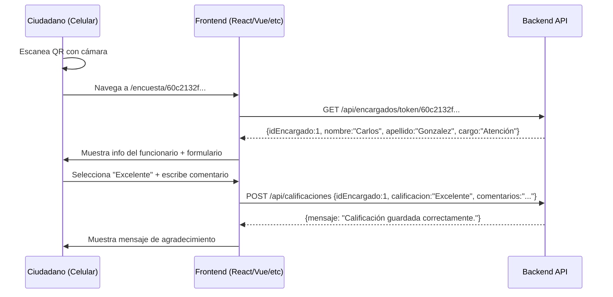

# Guía de Integración Frontend - Sistema de Calificación QR

## Resumen del Flujo

```
Encargado genera QR → Ciudadano escanea QR con celular → Navega a URL del frontend
→ Frontend consulta datos del funcionario → Muestra info + formulario de calificación
→ Ciudadano califica → Frontend envía calificación a la API → Se guarda en BD
```

---

## 1. ¿Cómo funciona el QR?

Cuando un encargado genera un QR desde el Panel Admin, se crea un **token único** (GUID de 32 caracteres hexadecimales) y una imagen QR que codifica una URL.

**La URL que codifica el QR es:**
```
http://localhost:5173/encuesta/{token}
```

Ejemplo real:
```
http://localhost:5173/encuesta/60c2132fdf8941b88d8ff1f33817d317
```

> La URL base (`http://localhost:5173`) se configura en `appsettings.json` → `AppSettings:FrontendUrl`. En producción sería algo como `https://encuestas.municipio.gob.mx/encuesta/{token}`

---

## 2. Lo que el Frontend necesita hacer

### Ruta que debe existir en el Frontend:
```
/encuesta/:token
```

### Paso 1: Obtener datos del funcionario

Cuando el ciudadano escanea el QR y llega a `/encuesta/{token}`, el frontend debe llamar a:

**Endpoint:**
```
GET http://localhost:5223/api/encargados/token/{token}
```

**Response exitosa (200):**
```json
{
  "idEncargado": 1,
  "nombre": "Carlos",
  "apellido": "Gonzalez",
  "cargo": "Atención al Ciudadano"
}
```

**Response si token inválido (404):**
```json
{
  "mensaje": "El código QR no es válido o ya no está disponible."
}
```

### Paso 2: Mostrar la página de encuesta

Con los datos recibidos, el frontend muestra:
- Nombre completo del funcionario
- Cargo
- Un formulario para calificar con:
  - 4 opciones de calificación: **Excelente**, **Buena**, **Regular**, **Mala**
  - Un campo opcional de comentarios (máximo 500 caracteres)
  - Botón "Enviar Calificación"

### Paso 3: Enviar la calificación

Cuando el ciudadano selecciona una calificación y envía:

**Endpoint:**
```
POST http://localhost:5223/api/calificaciones
```

**Request Body:**
```json
{
  "idEncargado": 1,
  "calificacion": "Excelente",
  "comentarios": "Muy buen servicio, me atendió rápido"
}
```

| Campo | Tipo | Requerido | Descripción |
|-------|------|:---------:|-------------|
| idEncargado | int | ✅ | ID del funcionario (recibido en paso 1) |
| calificacion | string | ✅ | Uno de: "Excelente", "Buena", "Regular", "Mala" |
| comentarios | string | ❌ | Texto libre, máximo 500 caracteres |

**Response exitosa (200):**
```json
{
  "mensaje": "Calificación guardada correctamente."
}
```

**Response de error - valor inválido (400):**
```json
{
  "mensaje": "Valor 'Invalido' no es válido. Valores aceptados: Excelente, Buena, Regular, Mala"
}
```

**Response de error - funcionario no existe (404):**
```json
{
  "mensaje": "Encargado con Id 999 no encontrado."
}
```

---

## 3. Flujo completo en diagrama de secuencia



---

## 4. Configuración CORS

La API ya tiene CORS configurado para desarrollo:

**Orígenes permitidos en desarrollo:**
- `http://localhost:5173` (Vite default)
- `http://localhost:3000` (CRA/Next default)

Si el frontend usa otro puerto, agregar en `ApiEncuestaPrototipe/appsettings.Development.json`:
```json
{
  "Cors": {
    "AllowedOrigins": [
      "http://localhost:5173",
      "http://localhost:3000",
      "http://localhost:TUPORT"
    ]
  }
}
```

---

## 5. URL de la API

**Desarrollo local:**
```
http://localhost:5223
```

Para arrancar la API:
```bash
cd ApiEncuestaPrototipe
dotnet run
```

Swagger disponible en: `http://localhost:5223/swagger`

---

## 6. Manejo de errores

Todos los errores de la API retornan JSON consistente:

| HTTP Status | Cuándo | Body |
|:-----------:|--------|------|
| 200 | Éxito | `{mensaje: "..."}` o datos |
| 400 | Validación (valor inválido, campo vacío) | `{mensaje: "..."}` |
| 404 | Token QR inválido o funcionario no existe | `{mensaje: "..."}` |
| 500 | Error interno | `{message: "...", correlationId: "GUID", timestamp: "ISO8601"}` |

---

## 7. Resumen de endpoints que usa el Frontend

| # | Endpoint | Método | ¿Cuándo se usa? |
|---|----------|--------|-----------------|
| 1 | `/api/encargados/token/{token}` | GET | Al cargar la página de encuesta (obtener datos del funcionario) |
| 2 | `/api/calificaciones` | POST | Al enviar la calificación del ciudadano |

Solo son **2 endpoints** los que necesita el frontend.

---

## 8. Estructura sugerida del Frontend

```
/encuesta/:token
├── Cargando... (mientras consulta GET /api/encargados/token/{token})
├── Si 404 → Mostrar "Este código QR no es válido"
├── Si 200 → Mostrar:
│   ├── Nombre: Carlos González
│   ├── Cargo: Atención al Ciudadano
│   ├── [Radio/Botones] Excelente | Buena | Regular | Mala
│   ├── [Textarea] Comentarios (opcional, max 500)
│   └── [Botón] Enviar Calificación
└── Después de enviar → Mostrar "¡Gracias por tu calificación!"
```

---

## 9. Ejemplo de implementación (React)

```jsx
// /encuesta/:token
function EncuestaPage() {
  const { token } = useParams();
  const [funcionario, setFuncionario] = useState(null);
  const [error, setError] = useState(null);
  const [calificacion, setCalificacion] = useState("");
  const [comentarios, setComentarios] = useState("");
  const [enviado, setEnviado] = useState(false);

  useEffect(() => {
    fetch(`http://localhost:5223/api/encargados/token/${token}`)
      .then(res => {
        if (!res.ok) throw new Error("QR inválido");
        return res.json();
      })
      .then(data => setFuncionario(data))
      .catch(err => setError(err.message));
  }, [token]);

  const enviar = async () => {
    const res = await fetch("http://localhost:5223/api/calificaciones", {
      method: "POST",
      headers: { "Content-Type": "application/json" },
      body: JSON.stringify({
        idEncargado: funcionario.idEncargado,
        calificacion,
        comentarios: comentarios || null
      })
    });
    if (res.ok) setEnviado(true);
  };

  if (error) return <p>Este código QR no es válido.</p>;
  if (!funcionario) return <p>Cargando...</p>;
  if (enviado) return <p>¡Gracias por tu calificación!</p>;

  return (
    <div>
      <h2>{funcionario.nombre} {funcionario.apellido}</h2>
      <p>Cargo: {funcionario.cargo}</p>
      
      <div>
        {["Excelente", "Buena", "Regular", "Mala"].map(v => (
          <button key={v} onClick={() => setCalificacion(v)}
            style={{ background: calificacion === v ? "#4CAF50" : "#eee" }}>
            {v}
          </button>
        ))}
      </div>

      <textarea maxLength={500} placeholder="Comentarios (opcional)"
        value={comentarios} onChange={e => setComentarios(e.target.value)} />

      <button onClick={enviar} disabled={!calificacion}>
        Enviar Calificación
      </button>
    </div>
  );
}
```

---

## 10. Notas importantes

- La comparación de calificación es **case-insensitive** ("excelente" = "Excelente" = "EXCELENTE")
- El `idEncargado` se obtiene del primer GET, no del token directamente
- Los comentarios son opcionales, enviar `null` si están vacíos
- El token QR es un GUID de 32 caracteres hex (ej: `60c2132fdf8941b88d8ff1f33817d317`)
- Si un QR se regenera desde el Panel Admin, el token anterior deja de funcionar (retorna 404)
- No hay límite de calificaciones por ciudadano — cada envío crea un nuevo registro
