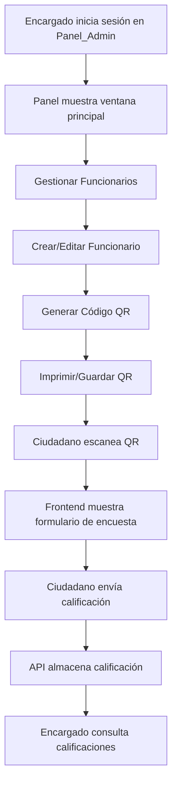

# GadiccCalificador - Sistema de Calificación de Funcionarios Municipales

Sistema de gestión de calificaciones para funcionarios municipales mediante códigos QR. Los encargados administrativos generan códigos QR únicos por funcionario desde un Panel de Escritorio (Windows Forms). Los ciudadanos escanean el QR para acceder a un formulario de encuesta web y enviar su calificación. La API almacena las calificaciones y permite consultar reportes estadísticos por funcionario.

## Stack Tecnológico

| Tecnología | Uso |
|------------|-----|
| .NET 8 | Framework principal (API, servicios, datos) |
| SQL Server | Base de datos relacional |
| Entity Framework Core 8 | ORM y migraciones |
| QRCoder | Generación de imágenes QR en formato PNG |
| Windows Forms | Panel administrativo de escritorio |
| BCrypt.Net-Next | Hash de contraseñas con salt |
| xUnit | Framework de pruebas unitarias |
| Moq | Mocking para pruebas unitarias |

## Prerrequisitos

- [.NET 8 SDK](https://dotnet.microsoft.com/download/dotnet/8.0) (8.0.x o superior)
- SQL Server (local o remoto) — Express, Developer o superior
- Visual Studio 2022 (v17.8+) o VS Code con la extensión C# Dev Kit
- Windows 10/11 (requerido para el proyecto Panel_Admin con Windows Forms)

## Diagrama de Flujo



## Endpoints de la API

| Método | Ruta | Descripción | Request Body | Response |
|--------|------|-------------|--------------|----------|
| POST | `/api/encargados` | Crear funcionario con QR | `{"nombre":"Juan", "apellido":"Pérez", "cargo":"Atención", "direccion":"Calle 1"}` | 201 `{idEncargado, nombre, apellido, tokenQR, qrBase64}` |
| GET | `/api/encargados` | Listar todos los funcionarios | - | 200 `[{idEncargado, nombre, apellido, cargo, direccion, tokenQR}]` |
| GET | `/api/encargados/token/{token}` | Obtener funcionario por token QR | - | 200 `{idEncargado, nombre, apellido, cargo}` |
| GET | `/api/encargados/{id}/qr` | Obtener imagen QR como PNG | - | 200 `image/png` |
| PUT | `/api/encargados/{id}` | Actualizar datos del funcionario | `{"nombre":"Juan", "apellido":"López", "cargo":"Caja", "direccion":"Calle 2"}` | 200 |
| POST | `/api/encargados/{id}/regenerar-qr` | Regenerar código QR (invalida anterior) | - | 200 `{qrBase64}` |
| POST | `/api/calificaciones` | Crear una calificación | `{"idEncargado":1, "calificacion":"Excelente", "comentarios":"Muy buen servicio"}` | 200 |
| GET | `/api/calificaciones/encargado/{id}` | Calificaciones por funcionario | - | 200 `[{idCalificacion, idEncargado, valor, comentarios, fechaHora}]` |

### Valores válidos para `calificacion`

`Excelente`, `Buena`, `Regular`, `Mala` (comparación sin distinguir mayúsculas/minúsculas)

## Esquema de Base de Datos

### Tabla: Encargados

| Columna | Tipo | Restricciones |
|---------|------|---------------|
| IdEncargado | int | PK, Identity |
| Nombre | nvarchar(100) | NOT NULL |
| Apellido | nvarchar(100) | NOT NULL |
| Cargo | nvarchar(100) | NULL |
| Direccion | nvarchar(200) | NULL |
| TokenQR | nvarchar(32) | UNIQUE, NULL |
| CodigoQR | nvarchar(max) | NULL (Base64 PNG) |

### Tabla: Calificaciones

| Columna | Tipo | Restricciones |
|---------|------|---------------|
| IdCalificacion | int | PK, Identity |
| IdEncargado | int | FK → Encargados(IdEncargado), NOT NULL, CASCADE DELETE |
| Valor | int | NOT NULL (enum: 1=Excelente, 2=Buena, 3=Regular, 4=Mala) |
| Comentarios | nvarchar(500) | NULL |
| FechaHora | datetime2 | NOT NULL, DEFAULT UTC NOW |

### Tabla: UsuariosAdmin

| Columna | Tipo | Restricciones |
|---------|------|---------------|
| IdUsuario | int | PK, Identity |
| NombreUsuario | nvarchar(50) | NOT NULL, UNIQUE |
| PasswordHash | nvarchar(max) | NOT NULL (BCrypt hash, cost ≥ 12) |
| FechaCreacion | datetime2 | NOT NULL, DEFAULT UTC NOW |

### Relaciones

- `Calificaciones.IdEncargado` → `Encargados.IdEncargado` (ON DELETE CASCADE)
- `Encargados.TokenQR` tiene índice único para búsquedas por QR
- `UsuariosAdmin.NombreUsuario` tiene índice único para login

## Estructura de la Solución

```
GadiccCalificador.slnx
│
├── Capa_Abstracciones/        → Interfaces, entidades del dominio, DTOs, enums y tipos comunes
│                                 Sin dependencias externas. Referenciado por todos los demás proyectos.
│
├── Capa_Datos/                → Implementación de repositorios con Entity Framework Core + SQL Server
│                                 DbContext, configuración Fluent API, migraciones.
│                                 Único proyecto con referencia a EF Core.
│
├── Capa_Servicios/            → Lógica de negocio (EncargadoService, CalificacionService,
│                                 QRServiceImpl, AuthService). Depende solo de Capa_Abstracciones.
│                                 Paquetes: QRCoder, BCrypt.Net-Next.
│
├── ApiEncuestaPrototipe/      → Web API .NET 8. Controllers HTTP, middleware de excepciones,
│                                 configuración CORS, Swagger, composition root (DI).
│
├── Panel_Admin/               → Aplicación Windows Forms (.NET 8). Login con lockout,
│                                 gestión de funcionarios, generación/impresión de QR,
│                                 consulta de calificaciones con filtros y estadísticas.
│
└── Pruebas/                   → Pruebas unitarias con xUnit + Moq.
                                  Tests de servicios, validación de enum, seguridad auth,
                                  generación QR y lógica del panel administrativo.
```

## Manejo de Errores de la API

La API implementa un middleware global de excepciones que retorna respuestas consistentes:

| Código HTTP | Cuándo | Contenido |
|:-----------:|--------|-----------|
| 400 | Validación fallida, `ArgumentException`, `ValidationException` | `{message, correlationId, timestamp}` |
| 404 | Recurso no encontrado | `{mensaje: "..."}` |
| 500 | Error interno no controlado | `{message, correlationId, timestamp}` |

- En modo **Development**: incluye campo `detail` con stack trace completo
- En modo **Production**: omite el stack trace por seguridad
- Cada error genera un `correlationId` (GUID) para trazabilidad en logs

## Script de Base de Datos

El archivo `setup_db.sql` en la raíz del proyecto crea la base de datos, tablas, índices y un usuario admin por defecto:

```bash
sqlcmd -S localhost -E -i setup_db.sql
```

### Usuario Admin por Defecto

| Campo | Valor |
|-------|-------|
| Usuario | `admin` |
| Contraseña | `Admin123!` |

> ⚠️ Cambia esta contraseña en producción.

## Configuración CORS

Los orígenes permitidos se configuran por entorno:

- **Development** (`appsettings.Development.json`): `http://localhost:5173`, `http://localhost:3000`
- **Production** (`appsettings.Production.json`): Configurar según dominio de producción

Si no se configuran orígenes, la API rechaza todas las solicitudes cross-origin.

## Ejecución Local

### 1. Crear la base de datos

```bash
sqlcmd -S localhost -E -i setup_db.sql
```

Esto crea la base de datos `GadiccCalificador`, las 3 tablas, índices y el usuario admin por defecto (`admin` / `Admin123!`).

### 2. Configurar cadena de conexión para la API (User Secrets)

```bash
cd ApiEncuestaPrototipe
dotnet user-secrets init
dotnet user-secrets set "ConnectionStrings:DefaultConnection" "Server=localhost;Database=GadiccCalificador;Trusted_Connection=True;TrustServerCertificate=True;"
```

### 3. Ejecutar la API

```bash
cd ApiEncuestaPrototipe
dotnet run
```

La API se ejecutará en `https://localhost:5001` (o el puerto configurado en `launchSettings.json`). Swagger disponible en `/swagger`.

### 4. Ejecutar el Panel_Admin

1. Editar `Panel_Admin/App.config` y configurar la cadena de conexión:

```xml
<connectionStrings>
  <add name="DefaultConnection"
       connectionString="Server=localhost;Database=GadiccCalificador;Trusted_Connection=True;TrustServerCertificate=True;"
       providerName="System.Data.SqlClient" />
</connectionStrings>
```

2. Compilar y ejecutar desde Visual Studio (establecer Panel_Admin como proyecto de inicio) o:

```bash
cd Panel_Admin
dotnet run
```

### 5. Ejecutar las pruebas

```bash
dotnet test
```

Para ejecutar con reporte de cobertura:

```bash
dotnet test --collect:"XPlat Code Coverage"
```

### 6. Compilar toda la solución

```bash
dotnet build GadiccCalificador.slnx
```
